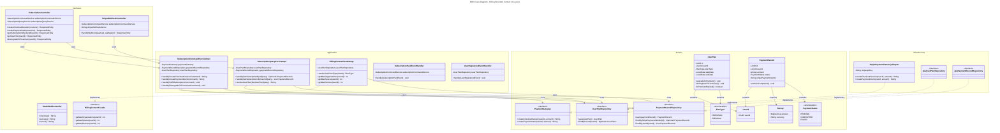

# Billing Bounded Context Class Diagram

This diagram displays the 4-layer DDD architecture for the Billing Bounded Context.

```mermaid
---
title: DDD Class Diagram - Billing Bounded Context (4 Layers)
---

classDiagram

namespace interfaces {
    class SubscriptionController {
        -SubscriptionCommandService subscriptionCommandService
        -SubscriptionQueryService subscriptionQueryService
        +createCheckoutSession(resource) ResponseEntity
        +createPaymentIntent(resource) ResponseEntity
        +getSubscriptionsByUserId(userId) ResponseEntity
        +getUserPlan(userId) ResponseEntity
        +downgradeToFreemium(userId) ResponseEntity
    }
    class StripeWebhookController {
        -SubscriptionCommandService subscriptionCommandService
        -String stripeWebhookSecret
        +handleWebhook(payload, sigHeader) ResponseEntity
    }
    class StaticWebController {
        +checkout() String
        +success() String
        +cancel() String
    }
    class BillingContextFacade {
        <<interface>>
        +getMaxOrganizations(userId) int
        +getMaxSpaces(userId) int
        +getMaxDevices(userId) int
    }
}

namespace application {
    class SubscriptionCommandServiceImpl {
        -PaymentGateway paymentGateway
        -PaymentRecordRepository paymentRecordRepository
        -UserPlanRepository userPlanRepository
        +handle(CreateCheckoutSessionCommand) String
        +handle(CreatePaymentIntentCommand) String
        +handle(FulfillSubscriptionCommand) void
        +handle(DowngradeToFreemiumCommand) void
    }
    class SubscriptionQueryServiceImpl {
        -UserPlanRepository userPlanRepository
        -PaymentRecordRepository paymentRecordRepository
        +handle(GetSubscriptionByIdQuery) Optional~PaymentRecord~
        +handle(GetSubscriptionsByUserIdQuery) List~PaymentRecord~
        +resolveUserPlan(GetUserPlanQuery) String
    }
    class BillingContextFacadeImpl {
        -UserPlanRepository userPlanRepository
        -resolveUserPlanType(userId) PlanType
        +getMaxOrganizations(userId) int
        +getMaxSpaces(userId) int
        +getMaxDevices(userId) int
    }
    class SubscriptionPaidEventHandler {
        -SubscriptionCommandService subscriptionCommandService
        +handle(SubscriptionPaidEvent) void
    }
    class UserRegisteredEventHandler {
        -UserPlanRepository userPlanRepository
        +handle(UserRegisteredEvent) void
    }
}

namespace domain {
    class UserPlan {
        -UUID id
        -UserId userId
        -PlanType planType
        -LocalDate startDate
        -LocalDate endDate
        +upgradeToPremium() void
        +downgradeToFreemium() void
        +isPremiumExpired() boolean
    }
    class PaymentRecord {
        -UUID id
        -UserId userId
        -Money amount
        -PaymentStatus status
        -String stripePaymentIntentId
        +markAsCompleted() void
    }
    class PaymentGateway {
        <<interface>>
        +createCheckoutSession(userId, amount) String
        +createPaymentIntent(userId, amount) String
    }
    class PlanType {
        <<enumeration>>
        FREEMIUM
        PREMIUM
    }
    class PaymentStatus {
        <<enumeration>>
        PENDING
        COMPLETED
        FAILED
    }
    class Money {
        +BigDecimal amount
        +String currency
    }
    class UserId {
        +UUID userId
    }
    class UserPlanRepository {
        <<interface>>
        +save(userPlan) UserPlan
        +findByUserId(userId) Optional~UserPlan~
    }
    class PaymentRecordRepository {
        <<interface>>
        +save(paymentRecord) PaymentRecord
        +findByStripePaymentIntentId(id) Optional~PaymentRecord~
        +findByUserId(userId) List~PaymentRecord~
    }
}

namespace infrastructure {
    class StripePaymentGatewayAdapter {
        -String stripeApiKey
        +createCheckoutSession(userId, amount) String
        +createPaymentIntent(userId, amount) String
    }
    class JpaUserPlanRepository {
        <<interface>>
    }
    class JpaPaymentRecordRepository {
        <<interface>>
    }
}

SubscriptionController --> SubscriptionCommandServiceImpl : uses
SubscriptionController --> SubscriptionQueryServiceImpl : uses
StripeWebhookController --> SubscriptionCommandServiceImpl : uses

SubscriptionCommandServiceImpl --> PaymentGateway : uses
SubscriptionCommandServiceImpl --> PaymentRecordRepository : uses
SubscriptionCommandServiceImpl --> UserPlanRepository : uses

SubscriptionQueryServiceImpl --> UserPlanRepository : uses
SubscriptionQueryServiceImpl --> PaymentRecordRepository : uses

BillingContextFacadeImpl ..|> BillingContextFacade : implements
BillingContextFacadeImpl --> UserPlanRepository : uses

StripePaymentGatewayAdapter ..|> PaymentGateway : implements

UserPlan --> UserId : contains
UserPlan --> PlanType : contains

PaymentRecord --> UserId : contains
PaymentRecord --> Money : contains
PaymentRecord --> PaymentStatus : contains

JpaUserPlanRepository ..|> UserPlanRepository : implements
JpaPaymentRecordRepository ..|> PaymentRecordRepository : implements
```
