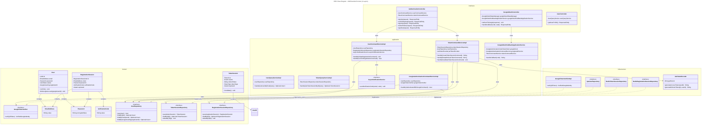

# IAM Bounded Context Class Diagram

This diagram displays the 4-layer DDD architecture for the Identity and Access Management (IAM) Bounded Context.

```mermaid
---
title: DDD Class Diagram - IAM Bounded Context (4 Layers)
---

classDiagram

namespace interfaces {
    class AuthenticationController {
        -UserCommandService userCommandService
        -TokenCommandService tokenCommandService
        +signUp(request) ResponseEntity
        +confirmSignUp(request) ResponseEntity
        +signIn(request) ResponseEntity
        +refreshToken(request) ResponseEntity
        +signOut(request) ResponseEntity
    }
    class GoogleOAuthController {
        -GoogleOAuthStateManager googleOAuthStateManager
        -GoogleOAuthCallbackApplicationService googleOAuthCallbackApplicationService
        +redirectToGoogle(response) void
        +handleCallback(code, state) ResponseEntity
    }
    class UserController {
        -UserQueryService userQueryService
        +getUserProfile() ResponseEntity
    }
}

namespace application {
    class UserCommandServiceImpl {
        -UserRepository userRepository
        -RegistrationSessionRepository registrationSessionRepository
        -AsyncNotificationService asyncNotificationService
        +handle(InitiateRegistrationCommand) void
        +handle(ConfirmRegistrationCommand) User
    }
    class UserQueryServiceImpl {
        -UserRepository userRepository
        +handle(GetUserByEmailQuery) Optional~User~
    }
    class TokenCommandServiceImpl {
        -TokenSessionRepository tokenSessionRepository
        -UserRepository userRepository
        -JwtTokenEncoder jwtTokenEncoder
        +handle(CreateTokenSessionCommand) String
        +handle(RotateRefreshTokenCommand) String
        +handle(InvalidateTokenSessionCommand) void
    }
    class TokenQueryServiceImpl {
        -TokenSessionRepository tokenSessionRepository
        +handle(GetTokenSessionByJtiQuery) Optional~TokenSession~
    }
    class GoogleAuthenticationCommandServiceImpl {
        -UserRepository userRepository
        -GoogleTokenVerifier googleTokenVerifier
        +handle(AuthenticateWithGoogleCommand) User
    }
    class GoogleOAuthCallbackApplicationService {
        -GoogleAuthorizationCodeTokenClient googleClient
        -GoogleAuthenticationCommandService googleAuthService
        -TokenCommandService tokenCommandService
        +handleCallback(code) String
    }
    class AsyncNotificationService {
        <<interface>>
        +sendVerificationCode(email, code) void
    }
}

namespace domain {
    class User {
        -UUID id
        -EmailAddress email
        -Password password
        -UserStatus status
        -GoogleUserId googleUserId
        +confirm() void
        +linkGoogleAccount(googleUserId) void
    }
    class TokenSession {
        -TokenJti jti
        -UserId userId
        -String refreshToken
        -TokenType tokenType
        -Instant expiresAt
        +invalidate() void
    }
    class RegistrationSession {
        -RegistrationSessionId id
        -EmailAddress email
        -Password password
        -VerificationCode verificationCode
        -Instant expiresAt
    }
    class GoogleTokenVerifier {
        <<interface>>
        +verify(idToken) VerifiedGoogleIdentity
    }
    class EmailAddress {
        +String value
    }
    class Password {
        +String encryptedValue
    }
    class VerificationCode {
        +String value
    }
    class UserRepository {
        <<interface>>
        +save(user) User
        +findById(id) Optional~User~
        +findByEmail(email) Optional~User~
        +findByGoogleUserId(googleUserId) Optional~User~
    }
    class TokenSessionRepository {
        <<interface>>
        +save(tokenSession) TokenSession
        +findByJti(jti) Optional~TokenSession~
        +deleteByJti(jti) void
    }
    class RegistrationSessionRepository {
        <<interface>>
        +save(registrationSession) RegistrationSession
        +findById(id) Optional~RegistrationSession~
        +deleteById(id) void
    }
}

namespace infrastructure {
    class JpaUserRepository {
        <<interface>>
    }
    class RedisTokenSessionRepository {
        <<interface>>
    }
    class RedisRegistrationSessionRepository {
        <<interface>>
    }
    class GoogleTokenVerifierImpl {
        +verify(idToken) VerifiedGoogleIdentity
    }
    class JwtTokenEncoder {
        -String jwtSecret
        +generateAccessToken(userId) String
        +generateRefreshToken(jti, userId) String
    }
}

AuthenticationController --> UserCommandServiceImpl : uses
AuthenticationController --> TokenCommandServiceImpl : uses

GoogleOAuthController --> GoogleOAuthCallbackApplicationService : uses

UserCommandServiceImpl --> UserRepository : uses
UserCommandServiceImpl --> RegistrationSessionRepository : uses
UserCommandServiceImpl --> AsyncNotificationService : uses

TokenCommandServiceImpl --> TokenSessionRepository : uses
TokenCommandServiceImpl --> UserRepository : uses
TokenCommandServiceImpl --> JwtTokenEncoder : uses

GoogleAuthenticationCommandServiceImpl --> UserRepository : uses
GoogleAuthenticationCommandServiceImpl --> GoogleTokenVerifier : uses

User --> EmailAddress : contains
User --> Password : contains

TokenSession --> UserId : contains

RegistrationSession --> EmailAddress : contains
RegistrationSession --> Password : contains
RegistrationSession --> VerificationCode : contains

GoogleTokenVerifierImpl ..|> GoogleTokenVerifier : implements
JpaUserRepository ..|> UserRepository : implements
RedisTokenSessionRepository ..|> TokenSessionRepository : implements
RedisRegistrationSessionRepository ..|> RegistrationSessionRepository : implements
```
