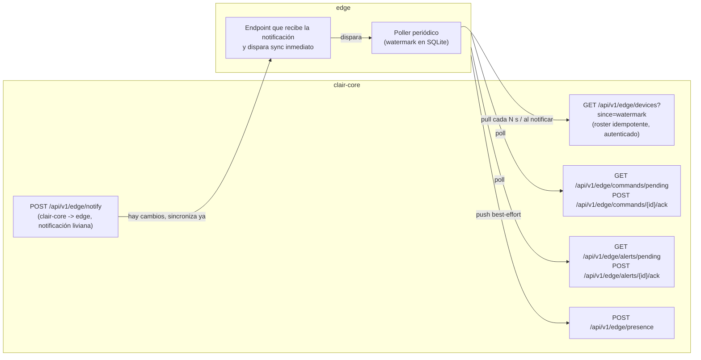

# Plan de migración: HTTP directo core-edge sin broker

## Contexto

`clair-core` (Spring Boot 3.5.5 / Java 25, DDD hexagonal, Postgres + Redis) y `edge`
(Flask/Python DDD, SQLite `clair_edge.db`) son repos hermanos que hoy están en un
estado arquitectónicamente inconsistente: el commit `45d405f remove: kafka` retiró
Kafka de `clair-core` pero **no** del `edge`, y el mecanismo de reemplazo (webhooks
HTTP fire-and-forget) nunca se terminó de cablear del lado del edge.

Este directorio contiene el plan completo, dividido en documentos ejecutables por
separado pero con dependencias explícitas entre sí.

## Diagnóstico del estado actual

1. **Kafka a medias** (`01-eliminar-kafka.md`). El edge sigue arrancando
   `KafkaInfrastructureClient`, tres consumers (`device`, `alerting`,
   `provisioning`) y un publisher (`iam` presence) que apuntan a un broker que ya
   no existe del lado de `clair-core`. `edge/app.py:94-95` intenta
   `bootstrap_topics` en cada arranque y solo falla silenciosamente
   (`app.py:96` `except Exception as exc: logger.warning(...)`) — el servicio
   arranca "verde" pero sin ninguna sincronización real, porque los tres
   consumers también intentan conectarse a un `KafkaConsumer` inexistente y
   levantan excepciones no capturadas en su hilo daemon.
   `clair-core` conserva restos muertos: `application.yml:31-32` (bootstrap
   servers), `application.yml:93-95` y `application.yml:109-111` (instancias
   resilience4j `kafkaPublisher` sin bean que las use), y javadoc/comentarios que
   describen topics Kafka en seis clases de eventos de integración.

2. **El puente HTTP core→edge está roto** (`03-contratos-http-core-edge.md`).
   `EdgeEventPublisher.java` (paquete `com.claircore.shared.infrastructure.edge`)
   postea a `/api/v1/edge/devices`, `/api/v1/edge/commands` y
   `/api/v1/edge/alerts`. Ninguna de las tres rutas existe en el edge (que solo
   expone `/api/v1/device/telemetry`, `/api/v1/device/commands/pending`,
   `/api/v1/device/commands/<id>/ack`, `/api/v1/device/<hardware_id>/connection-status`,
   `/api/v1/alerting/incidents/pending`, `/api/v1/alerting/incidents/<id>/ack`).
   El error se traga en `EdgeEventPublisher.java:52-55` con un comentario
   explícito de que faltaba manejo de reintento/cola.

3. **Push puro sin reconciliación** (`02-sincronizacion-devices.md`). El único
   mecanismo de propagación de estado de `Device` es el evento en el instante en
   que ocurre el cambio. `DeviceSeedOnStartup` →
   `SeedDevicesCommand` (`DeviceSeedOnStartup.java:20`) es idempotente por
   `serialNumber` del lado de `clair-core`, pero solo emite el evento
   `DeviceChangedIntegrationEvent` en el momento de la creación; si el edge está
   caído en ese instante, ese device jamás llega. No hay `updated_at`/versión ni
   soft-delete con tombstone en `Device.java`
   (`clair-core/src/main/java/com/claircore/device/domain/model/entities/Device.java`),
   así que tampoco hay forma de reconstruir el estado correcto después del hecho.

4. **La telemetría edge→core también está rota hoy, no solo el sync
   core→edge** (`01-eliminar-kafka.md`). El edge tiene un camino de entrega
   confiable ya construido — `device/application/outbox_processor.py`
   (`TelemetryOutboxProcessor`, arrancado en `edge/app.py:99`) — que escribe
   una entrada de outbox en la misma transacción que la telemetría
   (`device/application/services.py:78-85`) y la publica con reintentos con
   backoff exponencial y circuit breaker
   (`device/infrastructure/reliability/circuit_breaker.py`). El problema es
   que ese publicador final,
   `device/application/outboundservices/acl/kafka_core_context_facade.py`
   (`KafkaCoreContextFacadeImpl`), publica a los topics Kafka
   `clair.device.telemetry.recorded` y `clair.device.commands.acknowledged`,
   que ya no existen del lado de `clair-core`. Cada intento de envío falla,
   agota los `MAX_RETRIES = 5` (`outbox_processor.py:35`) y termina en
   `dead_letter` (`outbox_repository.mark_dead_letter`,
   `outbox_repository.py:77-82`). En paralelo, nadie invoca
   `POST /api/v1/evaluations/telemetry` en `clair-core`
   (`TelemetryEvaluationController.java:57`): el endpoint existe pero está
   huérfano. Es decir, hoy **ninguna telemetría real llega de edge a core**,
   tanto como ningún cambio de `Device` llega de core a edge.
5. **Ingesta de telemetría sin batch** (fuera del alcance de corrección
   inmediata, mencionado para contexto). `TelemetryEvaluationController.
   evaluateTelemetry` (`TelemetryEvaluationController.java:57-97`) procesa 1
   POST síncrono por lectura de sensor. No se toca en esta migración porque no
   hay requerimiento explícito de rediseñar la ingesta; se deja anotado como
   riesgo residual en `04-plan-de-corte.md`.

## Arquitectura objetivo

Principios acordados:

- **HTTP directo 100%, sin broker.** Ningún componente depende de Kafka ni de
  otro middleware de mensajería.
- **El pull idempotente es la fuente de verdad para la dirección core→edge**
  (sincronización de `Device`). Los eventos push (`EdgeEventPublisher`
  degradado, ver `02-sincronizacion-devices.md`) son solo una optimización de
  latencia ("hay cambios, sincroniza ya"); si se pierden, el poll periódico
  corrige el estado igualmente.
- **Watermark monotónico (`updated_at`/versión) + tombstones** en `Device`
  permiten una reconciliación correcta e idempotente sin reprocesar todo el
  catálogo en cada ciclo.
- **Para la dirección core→edge (sync de `Device`) no se introduce un
  outbox transaccional nuevo.** Se evaluó y se descartó para *este* flujo: el
  pull loop ya cubre los escenarios de pérdida de mensajes con menos piezas
  móviles que un patrón outbox + relay adicional del lado de `clair-core`.
- **Para la dirección edge→core (telemetría y ack de comandos) el outbox
  transaccional se conserva.** El edge ya tiene esa maquinaria construida y
  probada (`TelemetryOutboxProcessor`, backoff exponencial, circuit breaker);
  no se descarta ni se reemplaza por un pull — solo se reapunta su transporte
  final de Kafka a HTTP. Ambas decisiones son independientes: "sin outbox
  nuevo" aplica al pull de devices; "se conserva el outbox existente" aplica
  a la entrega de telemetría/acks. Ver `01-eliminar-kafka.md` para el detalle
  de qué se conserva y qué se borra.

## Mapa de los planes y orden de ejecución

| Orden | Plan | Depende de | Repos afectados |
|---|---|---|---|
| 1 | `01-eliminar-kafka.md` | — (se desarrolla junto a 2/3, pero su parte destructiva en el edge se despliega al final, ver `04-plan-de-corte.md`) | clair-core (restos), edge (retiro de Kafka; conserva y reapunta el outbox) |
| 2 | `02-sincronizacion-devices.md` | 1 y 3 deben tener listos los endpoints HTTP de reemplazo antes de que la parte destructiva de 1 (borrar Kafka del edge) se despliegue | clair-core (modelo + endpoint roster), edge (poller) |
| 3 | `03-contratos-http-core-edge.md` | 1, 2 (formaliza los endpoints que 1 y 2 ya definieron y agrega commands/alerting/presence/telemetría) | clair-core, edge |
| 4 | `04-plan-de-corte.md` | 1, 2, 3 | ambos, coordina el corte |
| 5 | `05-actualizacion-documentacion.md` | 1, 2, 3, 4 (se ejecuta en la Fase 3 de `04-plan-de-corte.md`, cuando el código ya está desplegado y estable) | clair-core (diagramas de class-diagrams con deuda Kafka intra-monolito preexistente), edge (diagramas y historias técnicas con Kafka edge-interno) |

El orden real de **despliegue** (no de redacción) es: primero los endpoints
HTTP nuevos en `clair-core` (aditivo, no rompe nada), después el edge con sus
pollers/publicadores HTTP nuevos conviviendo brevemente con Kafka, y solo al
final se borra Kafka del edge — nunca antes de tener el reemplazo funcionando.
Este orden se detalla y es la referencia autoritativa en
`04-plan-de-corte.md`; la tabla de arriba describe dependencias de contenido
entre documentos, no la secuencia de corte. El plan 05 (documentación) cierra
la secuencia, después de que el código de los planes 01-04 esté estabilizado.

## Fuera de alcance de esta migración

- Cualquier tema de despliegue, empaquetado (jar/Nix) o CI/CD.
- Cambios de esquema en bounded contexts no relacionados con `Device`,
  `DeviceCommand`, `AlertIncident` o `DevicePresence`.
- Rediseño de la ingesta de telemetría más allá del endpoint batch introducido
  en `03-contratos-http-core-edge.md` (sección 5.1) para reapuntar el outbox
  del edge de Kafka a HTTP. No se cambia el modelo de un-POST-por-lectura del
  lado del endpoint singular existente
  (`TelemetryEvaluationController.evaluateTelemetry`), ni se introduce
  batching real (agrupar varias entradas de outbox en una sola llamada HTTP)
  más allá de lo estrictamente necesario para no perder la capacidad de
  entrega confiable — eso queda anotado como mejora futura opcional en
  `03-contratos-http-core-edge.md` y `04-plan-de-corte.md`.
- **La documentación (diagramas de clases, historias técnicas) ya no está
  fuera de alcance**: se cubre explícitamente en `05-actualizacion-documentacion.md`,
  incluyendo la deuda preexistente de `clair-core` (diagramas que documentaban
  Kafka intra-monolito desde antes de esta migración).
