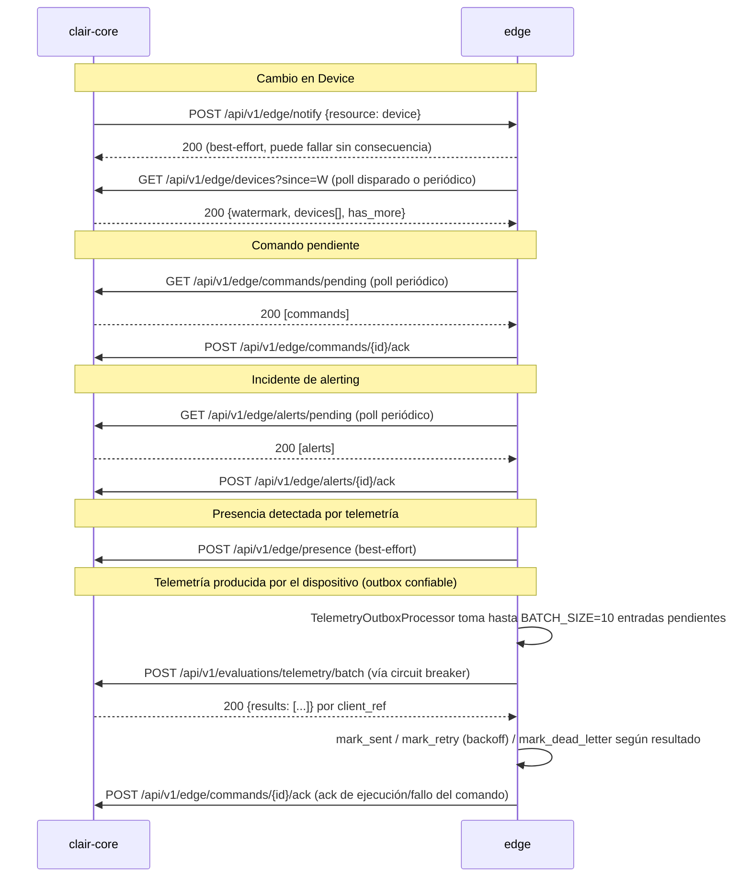

# Plan 03 — Catálogo definitivo de contratos HTTP core↔edge

## Objetivo

Fijar, en un solo documento, todos los endpoints HTTP entre `clair-core` y
`edge` tras retirar Kafka (plan 01) y adoptar el pull reconciliador (plan 02),
incluyendo la reposición de lo que hacían los topics de comandos, alerting y
presencia de IAM. Señala explícitamente qué rutas de las que ya invoca el
código hoy están rotas y a qué se mapean en el diseño final.

## Alcance

Solo contratos HTTP entre los dos servicios (autenticación, payload, códigos
de error, semántica de reintento). No cubre endpoints de cara al frontend/app
móvil de clair-core, ni la telemetría de dispositivos embebidos (`/api/v1/device/telemetry`
se mantiene sin cambios, no es parte de esta migración).

## Rutas actualmente rotas y su mapeo

| Ruta invocada hoy (rota) | Invocador | Estado | Mapeo en el diseño final |
|---|---|---|---|
| `POST /api/v1/edge/devices` | `EdgeEventPublisher.publishDeviceChanged` (`EdgeEventPublisher.java:38-40`) | 404 en edge, no existe | Se reemplaza por `POST /api/v1/edge/notify` (notificación liviana) + `GET /api/v1/edge/devices` (roster, ver plan 02) |
| `POST /api/v1/edge/commands` | `EdgeEventPublisher.publishDeviceCommand` (`EdgeEventPublisher.java:34-36`) | 404 en edge, no existe | Se reemplaza por `GET /api/v1/edge/commands/pending` (pull desde el edge) + `POST /api/v1/edge/notify` opcional para bajar latencia |
| `POST /api/v1/edge/alerts` | `EdgeEventPublisher.publishAlertIncident` (`EdgeEventPublisher.java:30-32`) | 404 en edge, no existe | Se reemplaza por `GET /api/v1/edge/alerts/pending` (pull desde el edge) + `POST /api/v1/edge/notify` opcional |

En los tres casos el problema de raíz es el mismo: `EdgeEventPublisher` asume
un modelo push-only donde el edge es un servidor HTTP que recibe eventos, pero
el edge nunca implementó esos receptores. El diseño final invierte la
dirección de la fuente de verdad: **el edge hace pull de core** para todo dato
autoritativo; core solo empuja una notificación vacía ("algo cambió, ve a
buscarlo"), reduciendo el push a una optimización de latencia no crítica.

## Catálogo completo de endpoints

### 1. Core → Edge (notificación liviana)

```
POST /api/v1/edge/notify
Headers: X-Edge-Token: <EDGE_TOKEN>, Content-Type: application/json
Body: { "resource": "device" | "command" | "alert", "hint": "<id opcional>" }

200 OK        -> el edge aceptó la notificación (no implica que ya sincronizó)
401           -> token inválido/ausente
5xx / timeout -> core lo loguea y descarta (no reintenta): el poll periódico
                 del edge cubre la pérdida
```

Reemplaza, en `clair-core/src/main/java/com/claircore/shared/infrastructure/edge/EdgeEventPublisher.java`,
los tres métodos `publishAlertIncident`, `publishDeviceCommand`,
`publishDeviceChanged` por un único método:

```java
public void notifyChange(String resource, String hint) {
    sendPost("/api/v1/edge/notify", Map.of("resource", resource, "hint", hint));
}
```

- `sendPost` (`EdgeEventPublisher.java:42-56`) se conserva tal cual en su
  manejo de error (catch + log, sin reintento) porque ahora es semánticamente
  correcto: la notificación es best-effort y el pull es la red de seguridad.
- Invocadores a actualizar: `AlertIncidentsChangedPublisher.java:45`,
  `DeviceCommandsPendingPublisher.java:21`,
  `ProvisioningDevicesChangedPublisher.java:21` — cada uno pasa a llamar
  `edgeEventPublisher.notifyChange("alert", ...)`,
  `notifyChange("command", ...)`, `notifyChange("device", ...)`
  respectivamente.
- **Semántica de reintento**: ninguna. Es fire-and-forget explícito y
  documentado (a diferencia del estado actual, donde era fire-and-forget por
  omisión de un caso no contemplado).

### 2. Edge → Core: roster de devices (detalle en plan 02)

```
GET /api/v1/edge/devices?since=<iso8601>&limit=<n>
Headers: X-Edge-Token: <EDGE_TO_CORE_TOKEN>

200 OK -> { "watermark": "...", "devices": [...], "has_more": bool }
401    -> token inválido/ausente (fail closed)
400    -> "since" mal formado
```

- **Semántica de reintento**: el edge reintenta con backoff exponencial acotado
  (p. ej. 5s, 10s, 20s, tope 60s) sin perder el `since` ya alcanzado.
- Implementación en core: nuevo endpoint REST en el contexto `device`,
  p. ej. `com.claircore.device.interfaces.rest.controllers.EdgeDeviceRosterController`,
  protegido por un filtro de autenticación de servicio (no JWT de usuario;
  token estático `EDGE_TO_CORE_TOKEN` vía header, análogo a `X-Edge-Token` pero
  en sentido inverso — se recomienda usar nombres de header distintos:
  `X-Edge-Token` para core→edge y `X-Core-Token` (o reutilizar el mismo
  secreto simétrico) para edge→core, documentado explícitamente para que no se
  confundan en la implementación).

### 3. Edge → Core: comandos pendientes (reemplaza `KafkaCommandConsumer`)

```
GET /api/v1/edge/commands/pending?hardware_id=<opcional>&since=<opcional>
Headers: X-Core-Token: <EDGE_TO_CORE_TOKEN>

200 OK -> [ { "command_id": "...", "device_id": "...", "hardware_id": "...",
              "command_type": "...", "payload": {...}, "issued_at": "..." }, ... ]
401    -> token inválido
```

```
POST /api/v1/edge/commands/{command_id}/ack
Headers: X-Core-Token: <EDGE_TO_CORE_TOKEN>
Body: { "hardware_id": "...", "result": "OK|FAILED", "detail": "..." }

200 OK -> confirmado
404    -> command_id no existe o ya no pertenece a un estado ack-able
401    -> token inválido
409    -> ya estaba acknowledged (idempotente: no es error fatal, el edge debe
          tratar 200 y 409 igual — "ya está resuelto")
```

- Reemplaza a `kafka_command_consumer.py` (retirado en el plan 01).
- El edge implementa un poller análogo al de devices (`device/application/command_poller.py`),
  reutilizando `DeviceCommandApplicationService.ingest_command_messages`
  (`edge/device/application/kafka_command_consumer.py:86`, lógica que se
  conserva, solo cambia el origen de los mensajes de Kafka a la respuesta HTTP).
- El core repone, del lado del dominio `DeviceCommand`, una query que hoy
  probablemente ya exista para "comandos pendientes" (usada para poblar el
  evento Kafka); se expone como endpoint REST en vez de publicarse a un topic.
- El edge responde al dispositivo después de persistir localmente el ACK y encolarlo en su outbox asíncrono; la entrega HTTP a este endpoint ocurre en segundo plano.
- **Semántica de reintento**: el ack es idempotente (409 tratado como éxito);
  el poll de pendientes se repite indefinidamente con el intervalo configurado.

### 4. Edge → Core: incidentes de alerting (reemplaza `KafkaAlertIncidentConsumer`)

```
GET /api/v1/edge/alerts/pending?since=<opcional>
Headers: X-Core-Token: <EDGE_TO_CORE_TOKEN>

200 OK -> [ { "alert_id": "...", "device_id": "...", "hardware_id": "...",
              "metric": "...", "threshold_value": ..., "actual_value": ...,
              "message": "...", "status": "...", "occurred_at": "...",
              "resolved_at": null } ]
401    -> token inválido
```

```
POST /api/v1/edge/alerts/{alert_id}/ack
Headers: X-Core-Token: <EDGE_TO_CORE_TOKEN>
Body: { "hardware_id": "...", "acknowledged_at": "..." }

200 OK / 409 (ya reconocido, tratar como éxito) / 401 / 404
```

- Reemplaza a `kafka_alert_incident_consumer.py`. Reutiliza
  `AlertIncidentEventApplicationService.ingest_alert_incident_changed_event`
  (`edge/alerting/application/kafka_alert_incident_consumer.py:76-84`), que ya
  acepta un `dict` de payload — el poller HTTP simplemente le pasa cada
  elemento del array recibido en vez del `message.value` de Kafka.
- **Semántica de reintento**: igual que comandos, ack idempotente + poll
  continuo.

### 5. Edge → Core: presencia de IAM (reemplaza `KafkaPresencePublisher`)

```
POST /api/v1/edge/presence
Headers: X-Core-Token: <EDGE_TO_CORE_TOKEN>
Body: { "device_id": "...", "hardware_id": "...", "status": "ONLINE|OFFLINE", "occurred_at": "..." }

200 OK -> aceptado
401    -> token inválido
5xx / timeout -> el edge loguea y descarta (best-effort, igual que hoy con Kafka
                 si el productor fallaba, ver `iam/application/services.py`
                 línea posterior a 80: `logger.warning(...)`)
```

- Reemplaza `KafkaPresencePublisher.publish_device_presence_changed`
  (`edge/iam/application/outboundservices/acl/kafka_presence_publisher.py:22-45`).
  Nueva clase `CorePresenceHttpPublisher` en el mismo paquete ACL
  (`edge/iam/application/outboundservices/acl/core_presence_http_publisher.py`),
  con el mismo método público `publish_device_presence_changed(payload) -> bool`
  para minimizar el cambio en `iam/application/services.py:47-48` (solo cambia
  la importación y la clase instanciada, no la lógica de negocio de
  `DevicePresenceApplicationService`).
- **Semántica de reintento**: ninguna explícita — igual que con Kafka hoy, es
  best-effort. Si se pierde una transición de presencia, el roster de devices
  (plan 02) eventualmente refleja el `status` correcto en su próximo pull,
  porque `status` es un campo de `Device` sincronizado por el roster. Esta es
  la razón de diseño por la que no hace falta cola/outbox aquí: el pull ya es
  la corrección de fondo.

### 5.1 Edge → Core: telemetría (reemplaza el transporte Kafka de `KafkaCoreContextFacadeImpl.publish_telemetry_recorded`)

Este es el único flujo edge→core que **conserva un mecanismo de reintento
propio** (el outbox del edge, ver `01-eliminar-kafka.md`), porque el volumen y
la criticidad de no perder telemetría lo justifican. El endpoint de core ya
existe (`POST /api/v1/evaluations/telemetry`,
`TelemetryEvaluationController.java:50-97`) pero hoy nadie lo invoca; se
decide **no crear un endpoint nuevo de un solo registro**, sino evaluar un
endpoint batch, dado que `TelemetryOutboxProcessor` ya procesa en lotes de
`BATCH_SIZE = 10` (`outbox_processor.py:40`) y hoy publica un mensaje Kafka
por entrada procesada del lote (`_send_entry`, `outbox_processor.py:103-121`,
llamado una vez por `entry` dentro del bucle de `_process_batch`,
líneas 84-101).

**Decisión: se agrega un endpoint batch nuevo**, en vez de reutilizar el
singular existente, porque:

- El outbox ya agrupa hasta 10 entradas por ciclo; enviarlas una por una
  significa 10 round-trips HTTP síncronos por ciclo de 5s
  (`POLL_INTERVAL_SECONDS = 5`, `outbox_processor.py:38`), lo cual es
  ineficiente sin necesidad.
- Un endpoint batch permite atomicidad más fina de éxito/fallo por elemento
  (ver formato de respuesta abajo), preservando la semántica actual de
  `_send_entry`: cada entrada del outbox se marca `sent`/`retry`/`dead_letter`
  de forma independiente.
- El endpoint singular `POST /api/v1/evaluations/telemetry` se conserva sin
  cambios para otros posibles usos (pruebas manuales, otros clientes), pero
  el edge no lo usa como transporte principal.

```
POST /api/v1/evaluations/telemetry/batch
Headers: X-Core-Token: <EDGE_TO_CORE_TOKEN>, Content-Type: application/json
Body: {
  "records": [
    {
      "client_ref": "<outbox_entry.id local, para correlacionar la respuesta>",
      "device_id": "...",
      "device_time": "...",
      "uptime_seconds": ...,
      "co2": ..., "temperature": ..., "humidity": ...,
      "pm1_0": ..., "pm2_5": ..., "pm10": ...,
      "wifi_status": "...", "network_name": "...", "signal_strength": ...,
      "country": "...", "health_status": "...", "status": "...",
      "recorded_at": "...", "occurred_at": "..."
    }
  ]
}

200 OK -> {
  "results": [
    { "client_ref": "...", "status": "CREATED" },
    { "client_ref": "...", "status": "ERROR", "reason": "DEVICE_NOT_FOUND" }
  ]
}
401 -> token inválido (todo el batch se descarta, ninguno se marca sent)
400 -> body malformado (todo el batch se descarta)
```

- El payload de cada elemento es el mismo que ya construye
  `TelemetryOutboxProcessor._build_payload` (`outbox_processor.py:144-171`);
  no se rediseña el formato de datos, solo se envuelve en un array con
  `client_ref` para poder mapear la respuesta de vuelta a cada
  `OutboxEntry.id`.
- **Semántica de reintento**: la responsabilidad de reintento sigue siendo
  100% del outbox del edge, sin cambios: `HttpCoreContextFacadeImpl.
  publish_telemetry_recorded` (nueva clase, ver plan 01) recibe un solo
  payload por invocación tal como lo espera hoy `_send_entry` — es decir, la
  interfaz `CoreContextFacade` se mantiene con la firma actual (un payload por
  llamada) y es la propia implementación HTTP la que internamente puede optar
  por acumular/enviar en batch si `ExternalCoreService` se extiende para ello,
  o bien mantenerse 1:1 con el endpoint singular como paso intermedio más
  simple. **Para no forzar un cambio de firma en `CoreContextFacade` (que
  rompería el contrato ya usado y probado del outbox), la implementación
  recomendada en una primera iteración es que `HttpCoreContextFacadeImpl.
  publish_telemetry_recorded` postee un único registro al endpoint batch con
  `records` de longitud 1.** Migrar a un envío real por lotes (agrupando
  varias `OutboxEntry` antes de invocar la facade) es una optimización de
  rendimiento incremental y opcional, no un requisito de esta migración; si se
  hace, requiere extender `TelemetryOutboxProcessor._process_batch` para
  invocar la facade una vez por lote en lugar de una vez por entrada, lo cual
  se declara explícitamente como **fuera de alcance de esta migración** y se
  deja anotado como mejora futura en `04-plan-de-corte.md`.
- Códigos de error por elemento (`DEVICE_NOT_FOUND`, `VALIDATION_ERROR`, etc.)
  permiten que `HttpCoreContextFacadeImpl` decida si el fallo es reintentable
  (5xx, timeout → sí) o definitivo (400 por dato inválido de origen → debería
  ir a `dead_letter` sin agotar reintentos, mejora posible sobre el
  comportamiento actual de `_send_entry`, que hoy trata todo fallo igual).

### 5.2 Edge → Core: ack de comandos (reemplaza `KafkaCoreContextFacadeImpl.publish_command_acknowledged`)

```
POST /api/v1/edge/commands/{command_id}/ack
```

Reutiliza exactamente el mismo endpoint ya definido en la sección 3
("Edge → Core: comandos pendientes"). `HttpCoreContextFacadeImpl.
publish_command_acknowledged` (nueva clase) llama a este endpoint en vez de
publicar a `DeviceKafkaTopics.COMMANDS_ACKNOWLEDGED`
(`kafka_core_context_facade.py:51`). No se crea un endpoint adicional: el flujo
de `DeviceCommandApplicationService.acknowledge_embedded_command`
(`edge/device/application/services.py:170`) adapta su resultado al payload exacto
`{hardware_id, result, detail}` esperado por este contrato; `command_id` va en la
ruta `POST /api/v1/edge/commands/{command_id}/ack`.

### 6. Sin cambios

- `POST /api/v1/device/telemetry`, `GET /api/v1/device/commands/pending`,
  `POST /api/v1/device/commands/<id>/ack`,
  `GET /api/v1/device/<hardware_id>/connection-status`,
  `GET /api/v1/alerting/incidents/pending`,
  `POST /api/v1/alerting/incidents/<id>/ack` — son endpoints que el **device
  físico** llama contra el **edge**, no forman parte del canal core↔edge y no
  se tocan en esta migración.

## Diagrama de flujo consolidado



## Autenticación y seguridad

- Dos tokens simétricos separados por dirección (o uno compartido, a decidir
  en implementación, pero documentado explícitamente):
  - `EDGE_TOKEN` — usado por core para llamar al edge (`X-Edge-Token`, ya
    existe en `EdgeEventPublisher.java:23,47`).
  - `EDGE_TO_CORE_TOKEN` — usado por el edge para llamar a core
    (`X-Core-Token`, nuevo).
- Todos los endpoints de este catálogo deben correr sobre TLS en cualquier
  entorno que no sea `localhost` de desarrollo, porque el roster y los
  comandos transportan `api_key` en claro en el payload JSON.
- Fail closed: cualquier endpoint de este catálogo sin token válido responde
  401, nunca degrada a "modo abierto" ni devuelve datos parciales.

## Tests requeridos

- **clair-core**
  - Contrato: cada endpoint nuevo (`/api/v1/edge/notify` receptor no aplica —
    ese lo expone el edge; los que expone core son roster, y las queries de
    comandos/alerts pendientes) devuelve 401 sin `X-Core-Token`.
  - `EdgeEventPublisherTest` (nuevo o adaptado): `notifyChange` construye el
    payload correcto y no lanza excepción si el edge no responde.
  - Adaptar `DeviceCommandsPendingPublisherTest.java` y
    `AlertIncidentsChangedPublisherTest` (si existe, verificar) para el nuevo
    método `notifyChange`.
  - Test de `POST /api/v1/evaluations/telemetry/batch`: crea registros válidos
    y devuelve `results` con `client_ref` correlacionado; un elemento inválido
    dentro del batch no bloquea el resto (respuesta por elemento, no todo o
    nada salvo 401/400 de nivel batch); sin token, 401 y ningún registro se
    persiste.
  - Test de `TelemetryEvaluationController.evaluateTelemetry` (endpoint
    singular existente): confirmar que sigue funcionando sin cambios de
    contrato tras introducir el batch (no debe quedar código duplicado
    divergente entre ambos endpoints; ambos deben delegar en el mismo
    `TelemetryEvaluationCommandService.handle`).
- **edge**
  - `HttpCoreContextFacadeImpl.publish_telemetry_recorded`: dado un payload,
    postea al endpoint batch con `records` de longitud 1 y devuelve `True`/`False`
    según la respuesta (200 con `status: CREATED` → `True`; `ERROR` o fallo de
    red/timeout → `False`), preservando la firma booleana que
    `TelemetryOutboxProcessor._send_entry` ya consume
    (`outbox_processor.py:113-121`).
  - `HttpCoreContextFacadeImpl.publish_command_acknowledged`: postea a
    `POST /api/v1/edge/commands/{command_id}/ack` y devuelve `True`/`False`
    según corresponda.
  - Test de regresión del outbox end-to-end (con `HttpCoreContextFacadeImpl`
    mockeado a nivel HTTP): una entrada exitosa se marca `sent`; una entrada
    que falla repetidamente se marca `dead_letter` tras `MAX_RETRIES`; el
    circuit breaker se abre tras 3 fallos consecutivos
    (`failure_threshold=3`, `outbox_processor.py:47`) y `_process_batch`
    corta el ciclo sin intentar el resto del batch
    (`CircuitBreakerOpenException`, líneas 93-97, 121-122).
  - Poller de comandos: dado un array de comandos pendientes, cada uno se
    ingiere vía `DeviceCommandApplicationService.ingest_command_messages` y se
    hace ack contra core tras aplicarlo localmente.
  - Poller de alertas: idem con `AlertIncidentEventApplicationService`.
  - `CorePresenceHttpPublisher`: dado un fallo HTTP (timeout, 5xx), el método
    devuelve `False` y no lanza excepción, preservando el contrato que
    `DevicePresenceApplicationService._publish_presence` ya espera
    (`iam/application/services.py`, manejo del valor de retorno booleano).
  - Endpoint receptor `/api/v1/edge/notify`: acepta el POST y dispara el
    trigger del poller correspondiente sin bloquear la respuesta HTTP (debe
    responder 200 de inmediato y disparar el poll de forma asíncrona, para no
    convertir la notificación en una llamada síncrona lenta).

## Riesgos y tradeoffs

- **Riesgo**: introducir dos tokens en vez de reutilizar uno solo añade una
  variable de entorno más a gestionar en ambos repos. *Alternativa
  descartada*: un único token simétrico para ambas direcciones — se descartó
  porque mezclar credenciales de direcciones distintas dificulta rotarlas por
  separado si una se compromete.
- **Riesgo**: el ack de comandos/alertas no idempotente podría bloquear al edge
  si reintenta un ack ya aplicado y core devuelve un error duro. *Mitigación*:
  contrato explícito de que 409 se trata como éxito (ya reflejado arriba).
- **Tradeoff**: notificación sin reintento (`POST /api/v1/edge/notify`) puede
  parecer "menos confiable" que Kafka, pero es intencional: la confiabilidad
  real la da el poll con watermark (plan 02), no la notificación. Añadir
  reintento a la notificación sería complejidad sin beneficio medible dado que
  el poll ya converge en el peor caso dentro del intervalo configurado.
